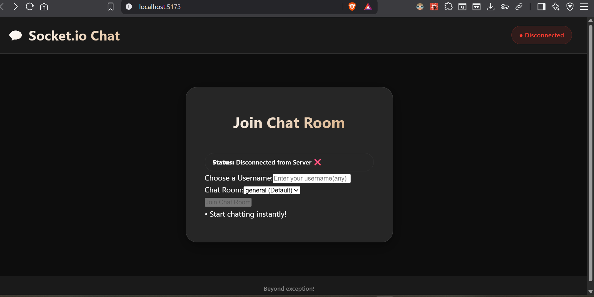
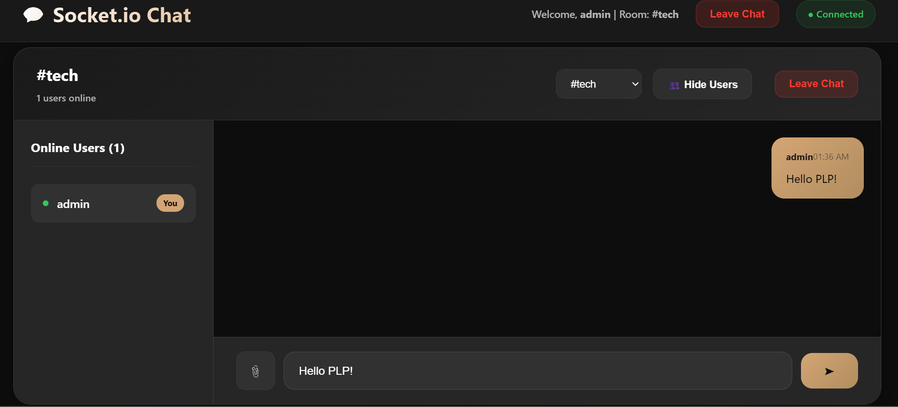

# Real-Time Chat Application with Socket.io

A full-stack real-time chat application built with React, Node.js, and Socket.io.

## Features

- Real-time messaging
- Multiple chat rooms
- Private messaging
- Typing indicators
- Read receipts
- Message reactions
- File sharing
- User presence
- Responsive design

## Tech Stack

**Frontend:**
- React 18
- Vite
- Socket.io Client
- CSS3

**Backend:**
- Node.js
- Express.js
- Socket.io
- CORS

## Quick Start

1. **Clone and install:**
   ```bash
   git clone <repository-url>
   cd socketio-chat-app
   npm run install-all


SCREENSHOTS

